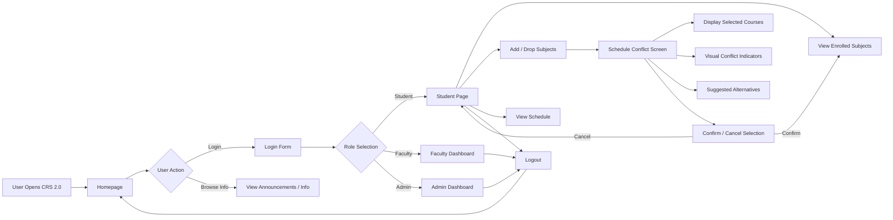
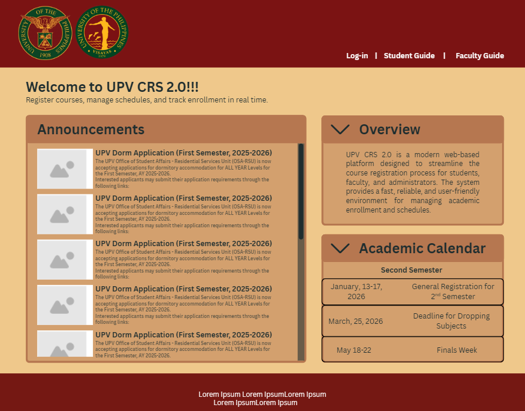
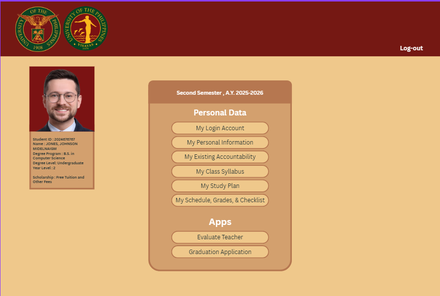
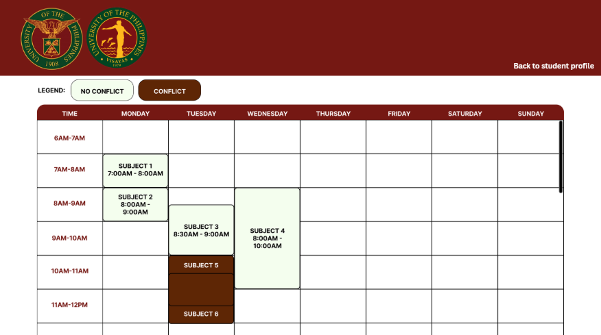
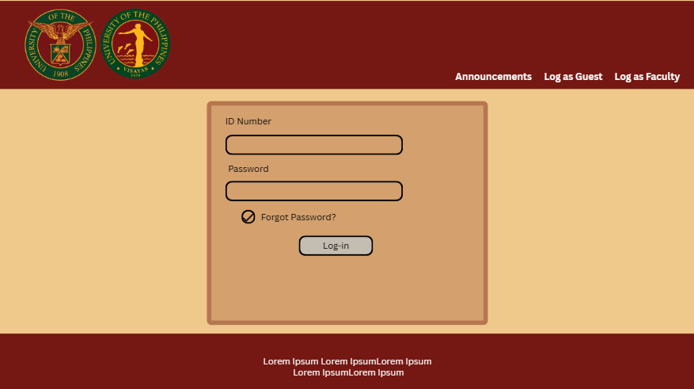

# CMSC126\_Activity\_Unit5\_Unit6

## System Summary

**Project Title:** UPV CRS 2.0 (Course Registration System 2.0)

CRS 2.0 is a modern, scalable, and user-friendly web application designed to replace the current UPV CRS. It aims to improve the student registration experience by providing faster performance, real-time schedule conflict detection, and a clean interface.

The system will allow:

- Students to register, add/drop subjects, and view schedules  
- Faculty to manage course offerings  
- Admins to oversee enrollment, reports, and system operations

**Key Features:**

- Real-time schedule conflict checking  
- Priority-based enrollment system  
- Responsive UI for mobile and desktop  
- Secure authentication and role-based access

**Improvements (to CRS)**
- Unlike CRS , which may require manual checking, CRS 2.0 instantly detects schedule conflicts, prerequisite issues, and slot availability during registration.
- CRS 2.0 features a more intuitive and responsive design, making navigation easier for students, faculty, and administrators across both desktop and mobile devices.

**Team Members:**

- \[Brent\]  
- \[Drew\]  
- \[Ethan\]  
- \[Jared\]

---

## Tech Stack

### Frontend Tools

**React**
- Component-based (perfect for dashboards)
- Good for building dynamic and interactive user interfaces
- Can create and reuse the elements/components you created

---

### Backend Tools
**Node.js + Express:**
- This combination provides a modern, efficient, and scalable foundation for building the server-side logic required by the system.
- One of the most widely used backend technologies.
- Used by Netflix, LinkedIn, and NASA.
- Well-suited for handling many simultaneous users

---

### Database

**MySQL:**

- Given the structured nature of our data such as students, courses, schedules, and enrollment records. MySQL provides a robust and reliable foundation for handling these relationships efficiently. 
- It is widely used across industries and has a strong track record of stability and performance. This makes it a dependable choice for managing critical academic data, including enrollment transactions and scheduling information.

---

### Other Tools (Optional)

- **Git & GitHub** – Version control and collaboration  
- **Figma** – UI/UX wireframes
- **Canva** - UI/UX page mockups

---

## Hosting (Platform for Hosting)

### Frontend Hosting
**Vercel:**
- Vercel is designed specifically for frontend applications, particularly those built with React. Given that our interface is built using React, Vercel is a highly suitable choice.
- Vercel provides a stable and production ready environment with minimal setup. It allows the team to focus on designing and improving the user interface such as dashboards, enrollment pages, and schedule views rather than managing hosting infrastructure.

---
### Backend Hosting
**Render:**
- This choice aligns well with our current stack (Node.js + Express) and allows us to deploy a reliable, scalable system
- In terms of cost, Render offers a free tier that is sufficient for development, testing, and even initial deployment. This makes it a practical choice for our current stage. As the system grows and user demand increases, the platform allows us to scale resources without needing to migrate to a different service.

## Mockups

### Flowchart

### Homepage

### Student Page

### Schedule / Conflict Check Screen

### Login Form

